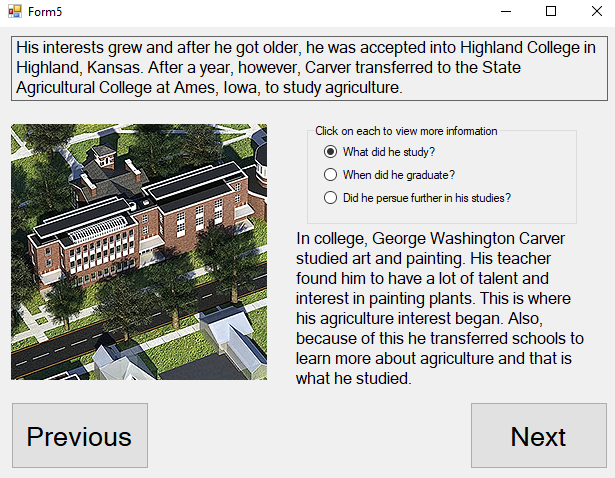

<h1 align="center">Black History Month Project</h1> 

<p align="center">
For my sophomore year Black History Month Project, we were tasked with choosing an African American figure from the past and make a program dedicated towards giving information about him. I chose George Washington Carver and made a flipbook about him with Visual Basic.
</p>

## Screenshot of a form


## Setup

#### Clone

```
git clone https://github.com/aahmad4/Black-History-Month-Project
```

#### Usage

```
cd Black-History-Month-Project
```
Open `Black History Project (George Washington Carver).sln` in Visual Studio and run the program.

## Contributing
Pull requests are welcome. For major changes, please open an issue first to discuss what you would like to change.

Please make sure to update tests as appropriate.
